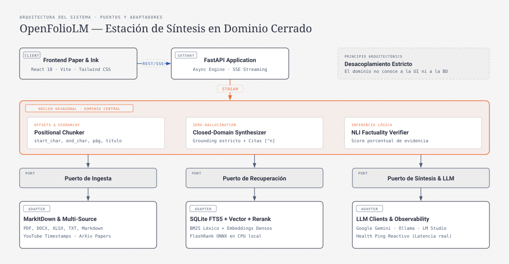

# OpenFolioLM

> Plataforma de investigación documental y síntesis en dominio cerrado con anclaje factual estricto, verificación de inferencia lógica (NLI) y exploración sincronizada de fuentes en interfaz Paper & Ink.

Para consultar la guía operativa completa paso a paso con todos los flujos de trabajo detallados, revise el [Manual de Uso de OpenFolioLM](docs/MANUAL_DE_USO.md).

---

## Visión y Principios de Diseño

OpenFolioLM es una estación de trabajo local y de código abierto orientada al análisis riguroso de documentos complejos sin fugas de privacidad ni dependencia de servicios propietarios en la nube:

1. **Síntesis en Dominio Cerrado (Zero-Hallucination Grounding)**: El modelo responde estrictamente dentro de los límites del material documental activo. Si una respuesta no cuenta con respaldo explícito en las fuentes, el sistema declara la ausencia de evidencia en lugar de generar inferencias especulativas.
2. **Segmentación Posicional y Citas Determinísticas**: Cada fragmento indexado preserva sus coordenadas exactas (`start_char`, `end_char`), página y jerarquía de títulos. Al interactuar con citas numéricas (`[^1]`, `[^2]`), la interfaz resalta el fragmento verbatim en el documento original.
3. **Control Granular de Fuentes (Source-Gated Context)**: Activación y desactivación individual de fuentes para delimitar con exactitud qué documentos participan en cada consulta.
4. **Espacio Analítico Sincronizado**: Visor lateral multimodal que vincula el diálogo con el texto íntegro de las fuentes, notas estructuradas, líneas de tiempo, grafos de conocimiento y herramientas de taxonomía.
5. **Auditoría de Factualidad NLI**: Evaluación sistemática de inferencia de lenguaje natural sobre las respuestas para certificar su consistencia lógica frente a las premisas textuales.

---

## Arquitectura del Sistema: Puertos y Adaptadores (Hexagonal)

El núcleo de negocio y las entidades de dominio operan de manera desacoplada de los adaptadores de infraestructura y persistencia:



> Puede visualizar o exportar este diagrama en alta resolución abriendo directamente [docs/architecture.html](docs/architecture.html).

### Componentes Principales

- **Ingesta (`app/adapters/markitdown_adapter.py`)**: Conversión estructurada de PDF, DOCX, PPTX, XLSX, imágenes, transcripciones de YouTube y texto plano a formato Markdown limpio.
- **Segmentador Posicional (`app/adapters/positional_chunker.py`)**: División determinística basada en encabezados Markdown y párrafos, calculando offsets absolutos para navegación en la interfaz.
- **Persistencia y Búsqueda Híbrida (`app/adapters/sqlite_store.py`)**: Almacenamiento relacional en SQLite con búsqueda de texto completo FTS5 (BM25) e indexación vectorial densa.
- **Re-clasificación Local (`app/adapters/reranker.py`)**: Modelo FlashRank (ONNX) ejecutado localmente en CPU para depurar y ordenar los fragmentos recuperados antes de la síntesis.
- **Capa de Servicio y API (`app/api/`)**: Endpoints asíncronos en FastAPI con streaming Server-Sent Events (SSE).
- **Interfaz de Usuario (`frontend/`)**: Aplicación React + Vite + Tailwind CSS construida bajo el sistema de diseño Paper & Ink.

---

## Puesta en Marcha

### Requisitos Previos
- Python 3.11 o superior.
- Node.js 18 o superior.
- Gestor de paquetes `pip` y `npm`.

### 1. Configuración del Backend

```bash
cd backend
python -m venv .venv

# En Windows:
.venv\Scripts\activate

# En Linux / macOS:
source .venv/bin/activate

pip install -r requirements.txt
```

Configure las variables de entorno creando un archivo `.env` en la carpeta `backend`:

```env
OPENFOLIO_DB_PATH=../openfolio.db
GEMINI_API_KEY=su_clave_aqui
DEFAULT_GEMINI_MODEL=gemini-3.6-flash
```

Inicie el servidor FastAPI:

```bash
uvicorn app.main:app --reload --host 127.0.0.1 --port 8000
```

### 2. Configuración del Frontend

En una terminal independiente:

```bash
cd frontend
npm install
npm run dev
```

Abra su navegador en `http://localhost:5173`.

### 3. Ejecución Directa mediante Scripts (Windows)

El proyecto incluye scripts por lotes para iniciar el entorno en un solo paso:
- `start.bat`: Inicializa simultáneamente el backend y el frontend.
- `start-backend.bat`: Inicializa el entorno virtual y el servidor Uvicorn.
- `start-frontend.bat`: Inicializa el servidor de desarrollo Vite.

---

## Verificación y Pruebas

### Suite de Pruebas del Backend
Ejecución de la suite completa con Pytest:
```bash
pytest backend/tests -v
```

### Comprobación Estática del Frontend
Verificación de tipos en TypeScript:
```bash
cd frontend
npx tsc --noEmit
```

---

## Licencia

Este proyecto se distribuye bajo los términos de la Licencia MIT.
