# Manual de Uso de OpenFolioLM

Guía operativa integral para la investigación documental, análisis crítico y síntesis en dominio cerrado con anclaje factual verificable.

---

## Índice

1. [Fundamentos y Filosofía del Sistema](#1-fundamentos-y-filosofía-del-sistema)
2. [Gestión de Proyectos y Motores de Lenguaje](#2-gestión-de-proyectos-y-motores-de-lenguaje)
   - [2.1 Creación y Organización de Proyectos](#21-creación-y-organización-de-proyectos)
   - [2.2 Selección de Modelos y Diagnóstico Reactivo](#22-selección-de-modelos-y-diagnóstico-reactivo)
3. [Ingesta y Curaduría de Fuentes](#3-ingesta-y-curaduría-de-fuentes)
   - [3.1 Carga de Archivos Locales](#31-carga-de-archivos-locales)
   - [3.2 Ingesta de Contenido Multimedia (YouTube)](#32-ingesta-de-contenido-multimedia-youtube)
   - [3.3 Descubrimiento de Literatura Científica](#33-descubrimiento-de-literatura-científica)
   - [3.4 Control de Contexto Activo para RAG](#34-control-de-contexto-activo-para-rag)
4. [Interacción, Síntesis y Citación Verificable](#4-interacción-síntesis-y-citación-verificable)
   - [4.1 Consulta en Dominio Cerrado](#41-consulta-en-dominio-cerrado)
   - [4.2 Navegación Bidireccional por Citas](#42-navegación-bidireccional-por-citas)
   - [4.3 Auditoría de Factualidad mediante NLI](#43-auditoría-de-factualidad-mediante-nli)
5. [Módulos de Análisis en el Visor Dividido](#5-módulos-de-análisis-en-el-visor-dividido)
   - [5.1 Dossier de Lectura](#51-dossier-de-lectura)
   - [5.2 Cuaderno de Síntesis](#52-cuaderno-de-síntesis)
   - [5.3 Categorización y Taxonomía](#53-categorización-y-taxonomía)
   - [5.4 Reportes Estructurados](#54-reportes-estructurados)
   - [5.5 Línea de Tiempo](#55-línea-de-tiempo)
   - [5.6 Grafo de Red](#56-grafo-de-red)
   - [5.7 Visor de Código](#57-visor-de-código)
6. [Colaboración, Exportación y Mantenimiento](#6-colaboración-exportación-y-mantenimiento)
   - [6.1 Publicación y Vista Compartida](#61-publicación-y-vista-compartida)
   - [6.2 Exportación e Importación de Conversaciones](#62-exportación-e-importación-de-conversaciones)
   - [6.3 Registros y Diagnóstico del Sistema](#63-registros-y-diagnóstico-del-sistema)

---

## 1. Fundamentos y Filosofía del Sistema

OpenFolioLM fue concebido como una estación de trabajo analítica local orientada a eliminar por completo las alucinaciones en tareas de síntesis sobre cuerpos documentales extensos.

A diferencia de los asistentes conversacionales generalistas que completan texto a partir de conocimiento probabilístico memorizado durante su entrenamiento, OpenFolioLM opera bajo el paradigma de **Síntesis en Dominio Cerrado (Closed-Domain Synthesis)**:

- **Anclaje Estricto (Grounding)**: El motor de lenguaje tiene prohibido generar afirmaciones que no cuenten con sustento textual explícito en los documentos activos.
- **Segmentación Posicional**: Cada fragmento indexado conserva sus coordenadas exactas dentro del texto original (`start_char`, `end_char`), número de página y jerarquía de títulos Markdown.
- **Trazabilidad Verbatim**: Toda cita generada en la respuesta (`[^1]`, `[^2]`) se vincula de manera determinística al fragmento original, permitiendo la comprobación visual instantánea.

---

## 2. Gestión de Proyectos y Motores de Lenguaje

### 2.1 Creación y Organización de Proyectos

Cada investigación se aísla en un espacio de trabajo independiente con su propia base de datos de documentos, fragmentos e índices vectoriales/léxicos.

1. En la barra superior, seleccione el menú desplegable de proyectos.
2. Haga clic en la opción para crear un nuevo proyecto.
3. Ingrese el nombre del proyecto y confirme.
4. El sistema inicializará el catálogo documental y limpiará el contexto para la nueva sesión.

<!-- IMAGEN: Interfaz de gestión y creación de proyectos -->
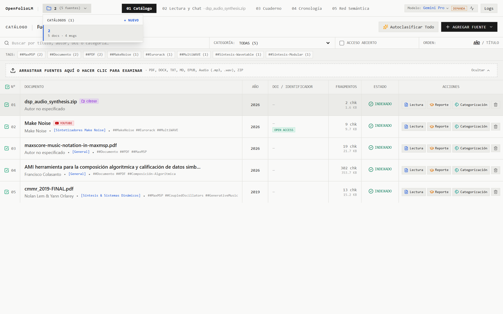

### 2.2 Selección de Modelos y Diagnóstico Reactivo

La barra de estado superior incluye un selector unificado de motores de lenguaje (`Modelo`), compatible con modelos locales (Ollama, LM Studio) y proveedores en la nube (Google Gemini, OpenAI compatible).

Para evitar que el usuario trabaje con modelos saturados o mal configurados, OpenFolioLM ejecuta un **Health Ping reactivo**:

- Al cargar la interfaz o cambiar de modelo, se envía una solicitud ligera de verificación de 1 token.
- **Comprobando**: Indicador transitorio que reporta que la prueba de conectividad está en curso.
- **Operativo con latencia**: Muestra el tiempo real de respuesta del proveedor (por ejemplo, `1120ms`).
- **Alta Demanda**: Indica saturación temporal o limitaciones de tasa (errores HTTP 429 o 503), manteniendo informada la sesión de trabajo.
- **Offline**: Alerta de que el servicio local no responde o las credenciales no son válidas, mostrando en un tooltip la causa exacta del fallo.

<!-- IMAGEN: Selector de modelos y badges de diagnóstico reactivo -->
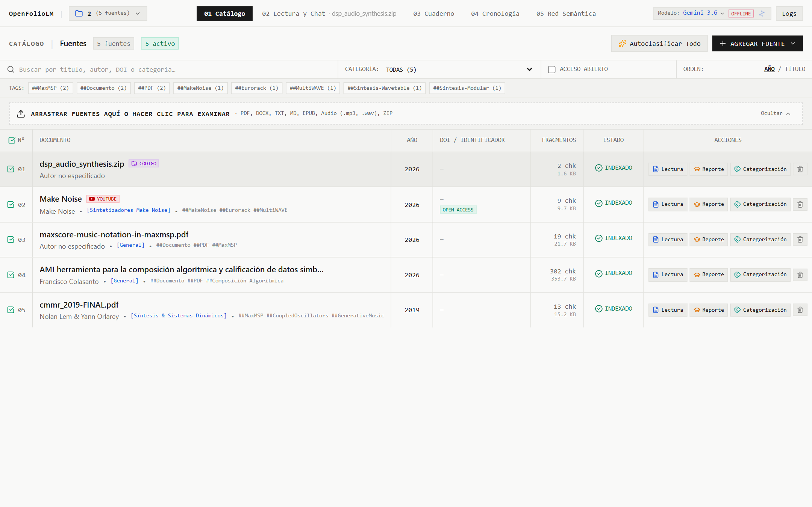

---

## 3. Ingesta y Curaduría de Fuentes

El panel principal de **Fuentes** centraliza todos los materiales documentales incorporados a la investigación.

<!-- IMAGEN: Catálogo general de fuentes e indicadores de estado -->

### 3.1 Carga de Archivos Locales

El convertidor interno procesa documentos convirtiéndolos a Markdown estructurado mientras preserva tablas, notas al pie y jerarquía de encabezados:

- **Formatos soportados**: PDF, DOCX, PPTX, XLSX, TXT, Markdown e imágenes con texto.
- **Procedimiento**: Arrastre los archivos directamente a la zona de carga de fuentes (la barra superior de arrastre en el catálogo o el cuadro central si el proyecto está vacío), o haga clic en ella para examinar los archivos desde su equipo. El sistema calculará el hash criptográfico para evitar duplicados y realizará la segmentación posicional en segundo plano.

### 3.2 Ingesta de Contenido Multimedia (YouTube)

OpenFolioLM permite transformar conferencias, clases o debates de video en fuentes de investigación citables:

1. Haga clic en la opción de agregar video o enlace.
2. Ingrese la URL del video de YouTube.
3. El sistema descargará la pista de subtítulos/transcripción oficial y asociará cada fragmento a su marca temporal exacta (`timestamp`).
4. Al hacer clic en una cita proveniente de un video, el visor posicionará el texto en el segundo exacto en que fue pronunciado.

<!-- IMAGEN: Ingesta de videos de YouTube con marcas de tiempo -->
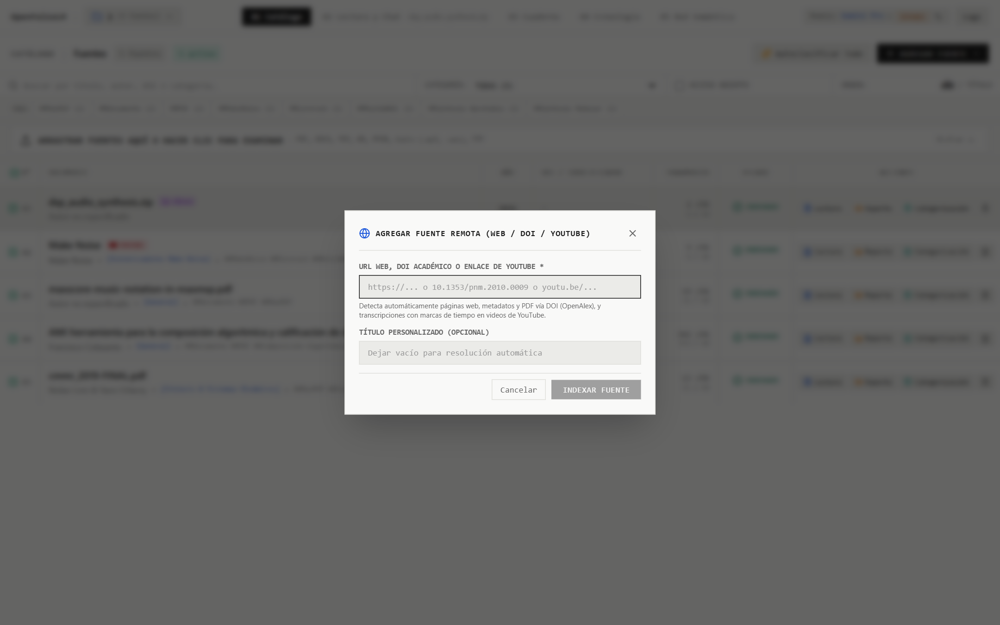

### 3.3 Descubrimiento de Literatura Científica

La herramienta incorpora un módulo especializado para buscar e incorporar directamente papers y literatura académica:

1. Abra el modal de **Literatura**.
2. Realice búsquedas por palabras clave, DOI o títulos temáticos conectando con repositorios abiertos (ArXiv, PubMed, Crossref).
3. Seleccione los artículos pertinentes e impórtelos directamente al catálogo del proyecto.

<!-- IMAGEN: Modal de descubrimiento e importación de literatura científica -->
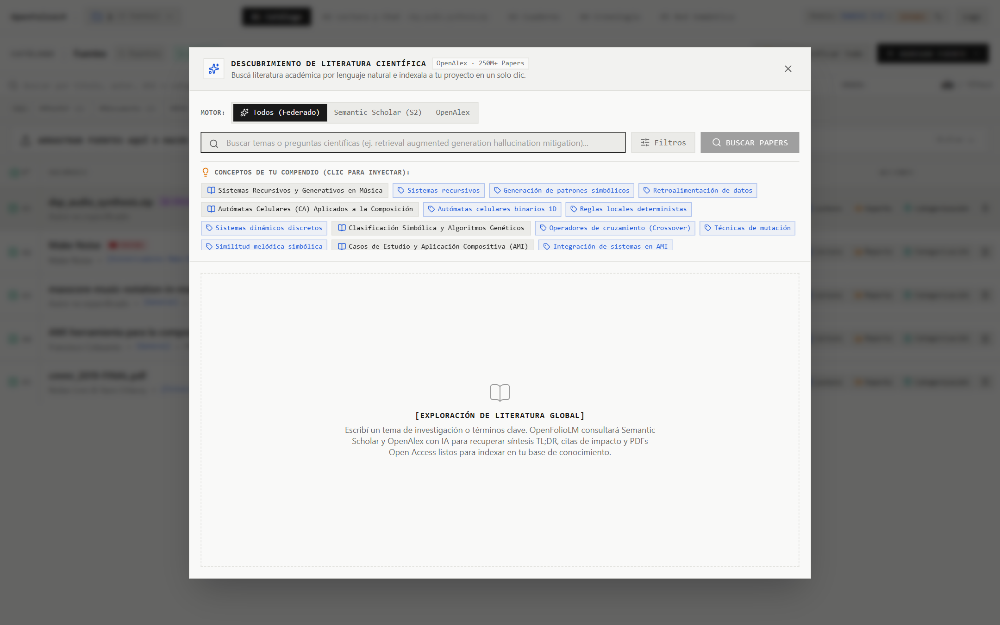

### 3.4 Control de Contexto Activo para RAG

No siempre se desea consultar la totalidad de la biblioteca al formular una pregunta. OpenFolioLM ofrece control granular sobre el contexto:

- Cada fuente en el catálogo cuenta con una casilla de verificación (`Activo`).
- En la barra de estado y en el encabezado del chat se indica en todo momento la cantidad de fuentes activas para la consulta.
- Si una fuente está desmarcada, sus fragmentos quedarán completamente excluidos del proceso de recuperación y síntesis.

<!-- IMAGEN: Selección de fuentes activas para RAG -->
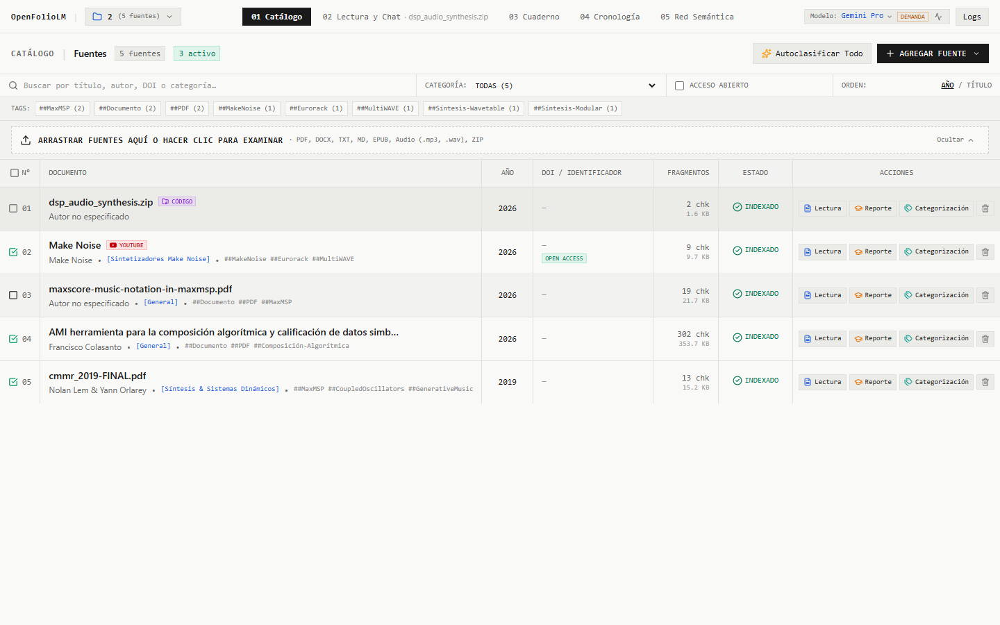

---

## 4. Interacción, Síntesis y Citación Verificable

El panel de **Chat** constituye el núcleo de consulta y diálogo investigativo.

<!-- IMAGEN: Vista general del chat con citas y respuestas analíticas -->
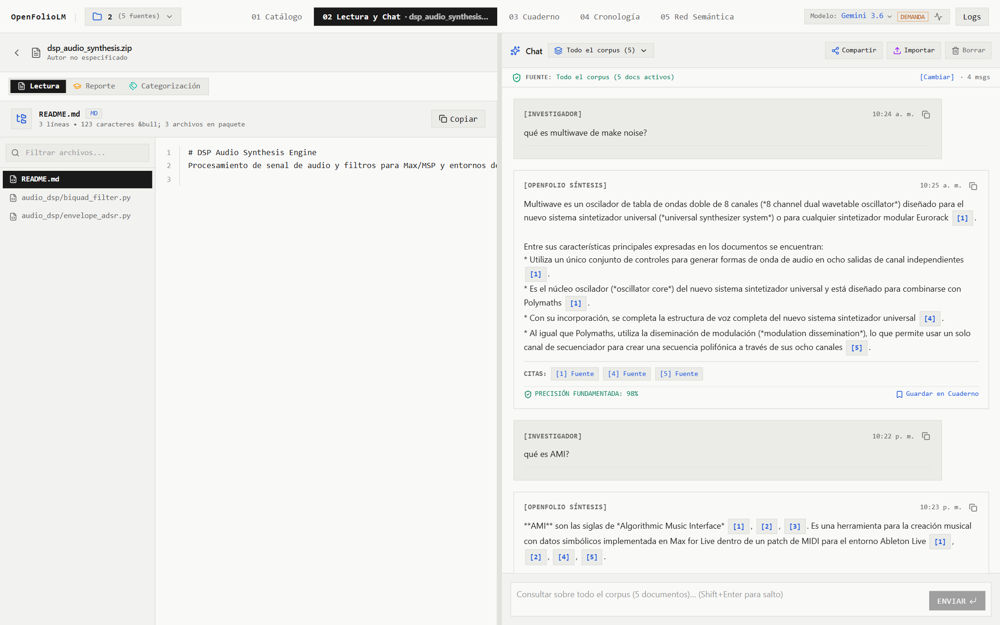

### 4.1 Consulta en Dominio Cerrado

Al enviar una pregunta:

1. El sistema realiza una búsqueda híbrida (BM25 léxico mediante SQLite FTS5 + similitud semántica vectorial).
2. Un modelo de re-clasificación local (FlashRank) filtra el ruido y prioriza únicamente los fragmentos de máxima relevancia.
3. El motor de síntesis genera la respuesta basándose de manera exclusiva en la evidencia recuperada.
4. Si la pregunta hace referencia a un tema ausente en las fuentes activas, el modelo declara explícitamente la falta de evidencia en lugar de inferir o inventar hechos.

### 4.2 Navegación Bidireccional por Citas

Cada conclusión de la respuesta contiene referencias numéricas (`[^1]`, `[^2]`):

- Al hacer clic en el número de cita dentro del chat, el panel lateral derecho se abre automáticamente en la pestaña de **Lectura**.
- El documento correspondiente se carga de inmediato.
- El visor realiza un desplazamiento suave hasta la ubicación exacta del fragmento citado y resalta el texto correspondiente.
- Si el documento es un PDF con múltiples páginas o una transcripción de YouTube, el visor se ubica en la página o segundo pertinente.

<!-- IMAGEN: Navegación de citas y resaltado sincronizado en el visor -->
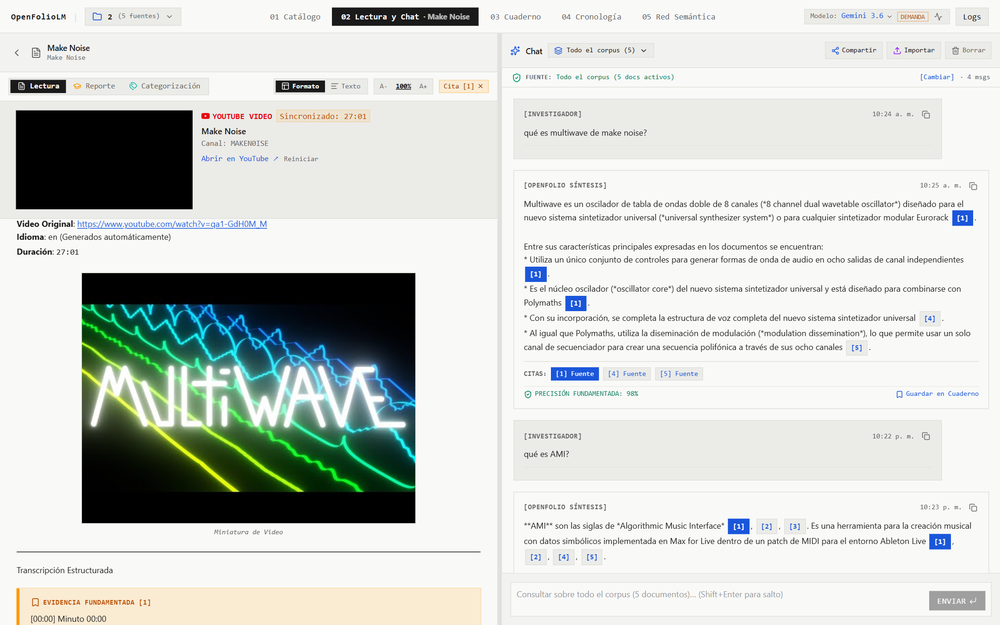

### 4.3 Auditoría de Factualidad mediante NLI

Para garantizar máxima confiabilidad científica y académica, las respuestas generadas son sometidas a un validador de Inferencia de Lenguaje Natural (NLI):

- Cada afirmación se coteja contra las premisas textuales recuperadas.
- En la parte inferior del mensaje se visualiza una insignia de factualidad (por ejemplo, `Factualidad NLI: 94%`).
- Esto permite detectar de un vistazo si alguna oración posee un soporte débil o marginal.

---

## 5. Módulos de Análisis en el Visor Dividido

El panel analítico lateral se adapta al tipo de estudio que se esté realizando, conmutando entre siete vistas especializadas:

### 5.1 Dossier de Lectura
Visor continuo del texto íntegro de la fuente seleccionada. Permite la lectura reposada, inspección de encabezados y visualización de todos los fragmentos posicionales del documento.

<!-- IMAGEN: Dossier de lectura y exploración de texto completo -->
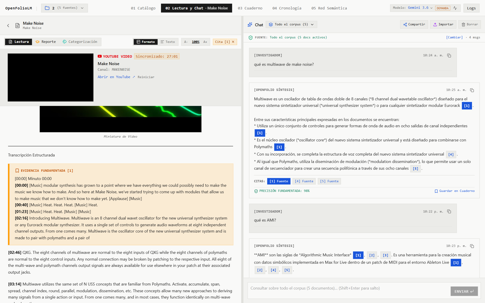

### 5.2 Cuaderno de Síntesis
Espacio de trabajo para redacción de conclusiones personales y consolidación de notas:

- **Vista Previa por Defecto**: Las notas se presentan inicialmente renderizadas en Markdown limpio para facilitar la lectura.
- **Modo Edición**: Permite modificar el contenido con sintaxis Markdown completa.
- **Citas Funcionales**: Las citas incrustadas en las notas (`[^n]`) son interactivas y navegan directamente al fragmento en el visor de lectura.
- **Ver en Chat**: Cada nota guardada desde una respuesta de la conversación incluye un acceso directo para volver a posicionar el chat en el mensaje exacto donde se originó.

<!-- IMAGEN: Cuaderno de síntesis con notas y citas interactivas -->
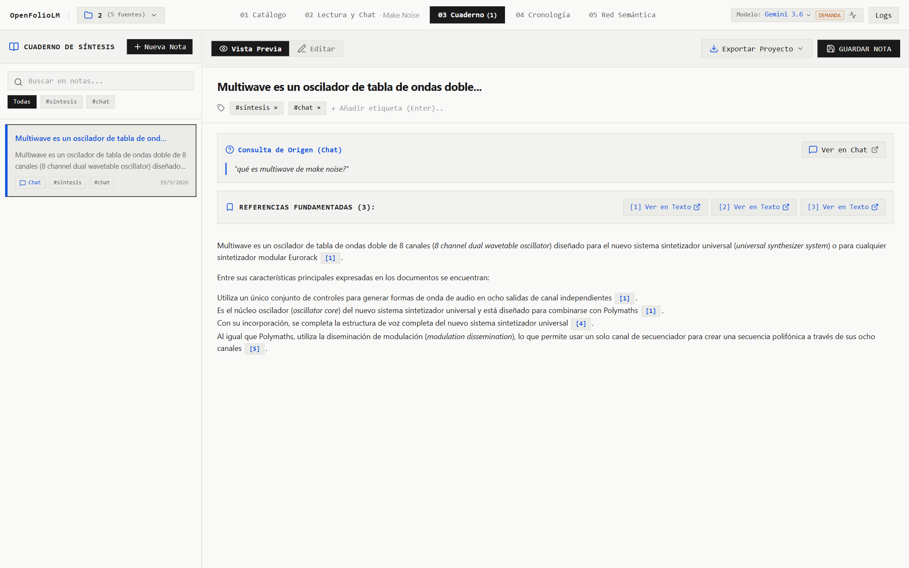

### 5.3 Categorización y Taxonomía
Explora la estructura temática del corpus documental. Agrupa fuentes y fragmentos por etiquetas semánticas, facilitando el descubrimiento de tópicos compartidos entre diferentes textos.

<!-- IMAGEN: Módulo de categorización y taxonomía temática -->

### 5.4 Reportes Estructurados
Generador de documentos analíticos derivados:
- Resúmenes ejecutivos.
- Guías de estudio estructuradas con preguntas y respuestas clave.
- Tablas comparativas de conceptos entre múltiples autores.

<!-- IMAGEN: Generación de reportes analíticos -->

### 5.5 Línea de Tiempo
Reconstruye una secuencia cronológica a partir de fechas, hitos y eventos detectados en los textos de las fuentes activas, ideal para análisis histórico o reconstrucción de casos de estudio.

<!-- IMAGEN: Vista de línea de tiempo cronológica -->
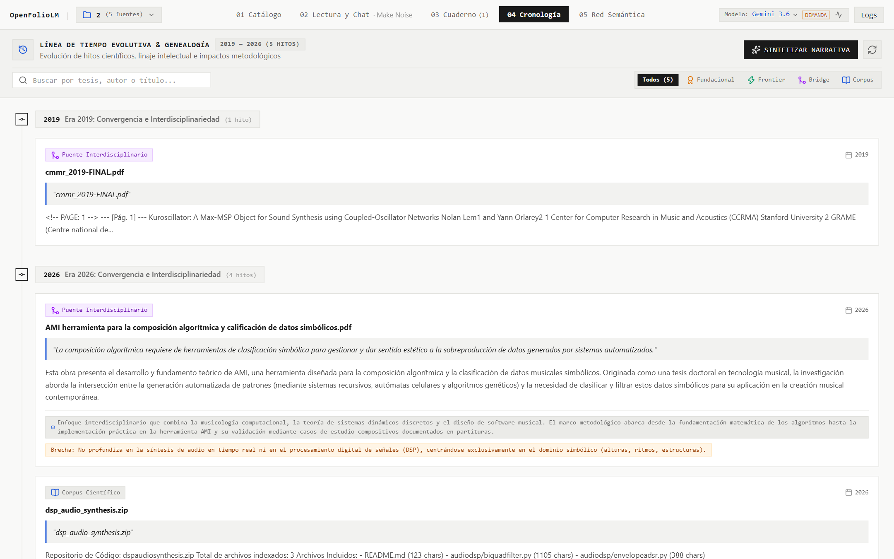

### 5.6 Grafo de Red
Representación gráfica interactiva que ilustra las conexiones entre fuentes, fragmentos temáticos y conceptos clave, permitiendo identificar núcleos de información y documentos puente.

<!-- IMAGEN: Grafo de red relacional de entidades y fuentes -->
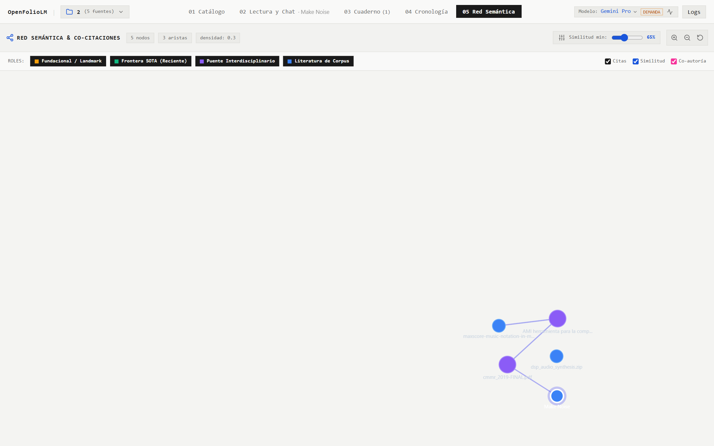

### 5.7 Visor de Código
Entorno de inspección con soporte de coloreado de sintaxis para proyectos que incorporan documentación técnica, scripts o algoritmos entre sus fuentes.

<!-- IMAGEN: Visor de código con coloreado de sintaxis -->
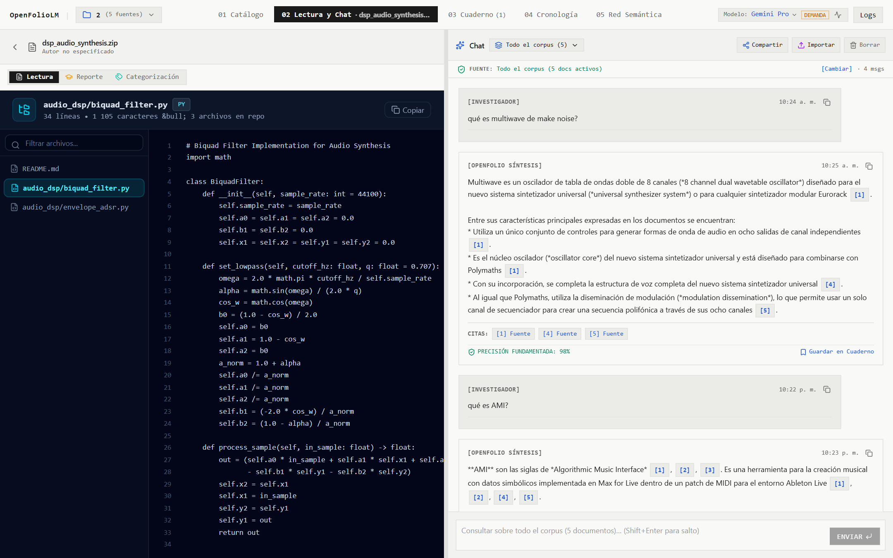

---

## 6. Colaboración, Exportación y Mantenimiento

### 6.1 Publicación y Vista Compartida

Las investigaciones y sesiones de consulta pueden compartirse sin necesidad de otorgar acceso directo a la infraestructura local:

- Utilice el botón de compartir conversación.
- Se genera una vista pública autocontenida que respeta fielmente la estética Paper & Ink, preservando la transcripción completa de mensajes, citas textuales y porcentajes de factualidad.
- El receptor puede explorar las evidencias sin modificar el proyecto original.

<!-- IMAGEN: Modal de compartir y vista pública de la conversación -->
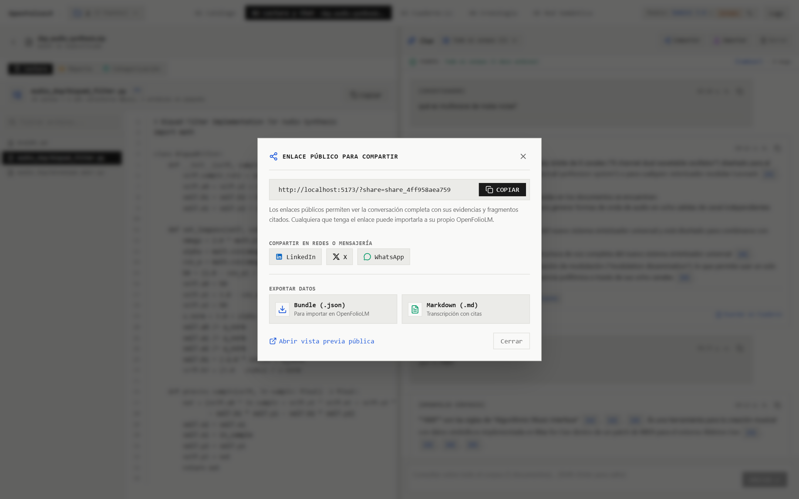

### 6.2 Exportación e Importación de Conversaciones

- **Descarga JSON**: Cada sesión puede ser respaldada en formato `.json` estructurado con la totalidad de metadatos, citas y parámetros del modelo utilizado.
- **Importación**: Permite restaurar conversaciones pasadas en cualquier instalación de OpenFolioLM.

### 6.3 Registros y Diagnóstico del Sistema

Para auditoría técnica y depuración:

- La ventana modal de **Registros del Sistema (System Logs)** ofrece monitoreo en tiempo real de las solicitudes HTTP, eventos de streaming SSE, llamadas a la API de embeddings y operaciones de re-ranking.
- Facilita la identificación de problemas de red o demoras en la respuesta de los modelos.

<!-- IMAGEN: Modal de registros del sistema en vivo -->
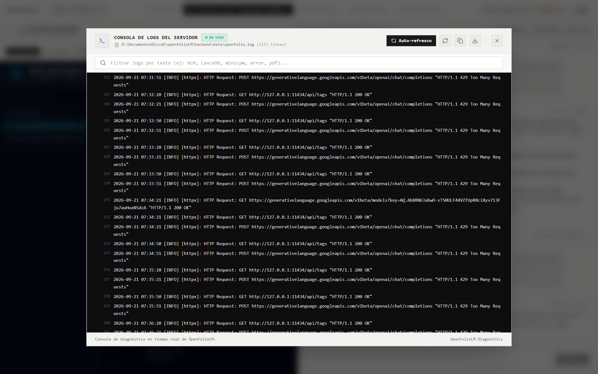
